<h1 align="center">🙋‍♂️ Maze in the 90's 🙋‍♀️</h1>

## 📌 목차

1. [프로젝트 소개](#triangular_flag_on_post-프로젝트-소개)

2. [기술스택](#triangular_flag_on_post-기술스택)

3. [Project Period](#triangular_flag_on_post-project-period)

4. [Contributors](#triangular_flag_on_post-contributors)

5. [프로젝트세팅](#triangular_flag_on_post-프로젝트-세팅)

6. [ERD](#triangular_flag_on_post-ERD)

7. [시스템 아키텍쳐](#triangular_flag_on_post-시스템-아키텍쳐)

8. [주요 기술](#triangular_flag_on_post-주요-기술)

9. [서비스 소개](#triangular_flag_on_post-서비스-소개)

10. [개발기록](#triangular_flag_on_post-개발기록)

## :triangular_flag_on_post: 프로젝트 소개

- #### 프로젝트 개요
  
  - `'Maze in the 90's`는 모션 인식 AI를 활용한 모션 인식 게임입니다.
  
  - 링크 

- #### 주요 기능
  
  - 미로 찾기 Single Play
  - 미로 찾기 Multi Play 
  - 마이페이지

- #### 프로젝트 영상: https://youtu.be/pJqKolIzO7I

- #### 노션: https://www.notion.so/17acef0785ee447f89aca7375e65307f

## :triangular_flag_on_post: 기술스택

| 용도       | 스택                                                                                                                                                                                                             | 버전                |
| -------- | -------------------------------------------------------------------------------------------------------------------------------------------------------------------------------------------------------------- | ----------------- |
| React 편집 |                                                                                        | 18                |
| C# 편집    |                                                                                                  | 2019, community   |
| 배포서버     |                                                                                                                                                         |                   |
| DB       |                                                                                            |                   |
| 서버 설계    |                                                                                                                                                  | 3.10.1            |
| 인게임 개발   |                                                                                                                      | 2020.3.30f1 (LTS) |
| 웹빌드      |                                                                                                                  |                   |
| 형상관리     |                                                                                                                      |                   |
| 협업       |  |                   |

## 

## :triangular_flag_on_post: Project Period

2022.02.28 - 2022.04.08 (6주)

## :triangular_flag_on_post: Contributors

| 팀원   | 역할      | 비고                              | 깃헙                                 |
| ---- | ------- | ------------------------------- | ---------------------------------- |
| 오제노  | 팀장, 백엔드 | AI 및 전반적인 통신 연구                 | https://github.com/ohzeno          |
| 이승훈  | 백엔드     | Photonserver 담당 및 멀티플레이 게임 제작   | https://github.com/SeungHunL       |
| 조은누리 | 백엔드     | Firebase 및 회원 관리 담당             | https://github.com/eunnuricho      |
| 박수아  | 프론트엔드   | react-django 통신 연구, 컴포넌트 제작     | https://github.com/pakrsua         |
| 박신영  | 프론트엔드   | Unity - Scene 제작, React - UI 제작 | https://github.com/shinyoung-angel |
| 박준영  | 프론트엔    | 싱글플레이 및 멀티플레이 맵 제작, 배포 담당       | https://github.com/JUNYOUNG31      |

## :triangular_flag_on_post: 프로젝트 세팅

- **React**
  
  > ```javascript
  > # 라이브러리 설치 및 실행 
  > yarn install
  > npm start
  > ```

- **Django**
  
  > ```python
  > # 가상환경 생성 후 활성화   
  > python -m venv venv 
  > source venv/Scripts/activate
  > 
  > # 라이브러리 설치 
  > pip install -r requirements.txt
  > 
  > # 서버 실행
  > python manage.py runserver
  > ```

## 

## :triangular_flag_on_post: ERD

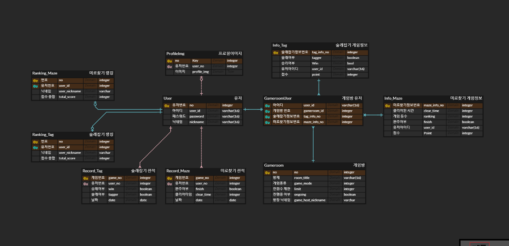

## :triangular_flag_on_post: 시스템 아키텍쳐

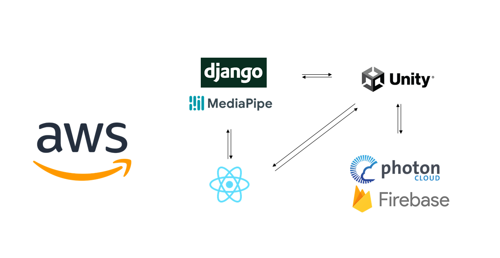

## :triangular_flag_on_post: 주요 기술

- Unity

- PhotoServer

- Firebase

- React

- Django 

## :triangular_flag_on_post: 서비스 소개

### 1. 로그인 및 회원가입

- **로그인**: Google, Github를 통한 로그인 가능 

- **랭킹 확인**: 로그인 없이 랭킹 확인 가능 
  
  
  
  

- **회원가입**
  
  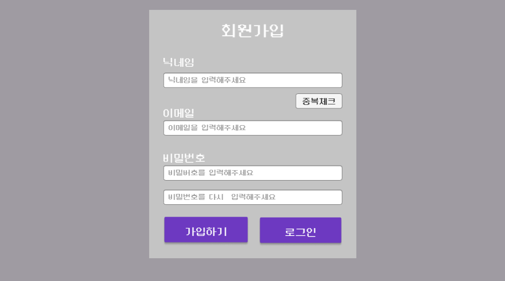
  
  ---

### 2. 로비

- **프로필, 마이페이지, 랭킹, 방 목록 확인 가능**
  
  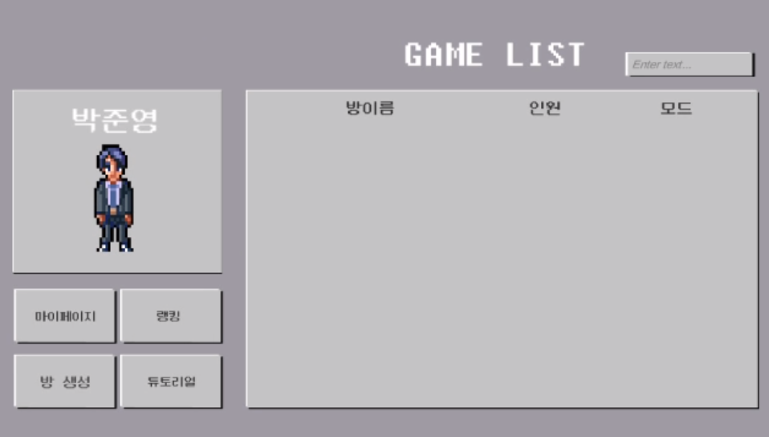

- **방생성**
  
  
  
  

- **튜토리얼**
  
  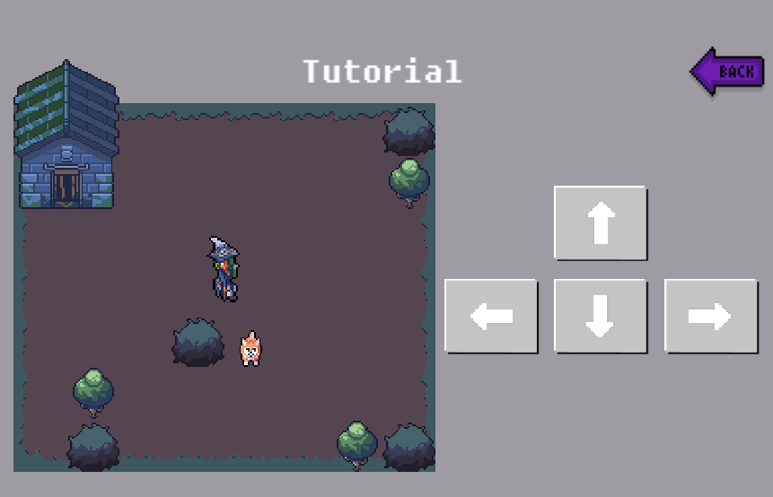
  
  ---

### 3. 마이페이지

- **유저의 모든 게임 전적 확인 가능**

- **각 게임 별 최고 성적 확인 가능**

- **프로필 이미지 변경**
  
  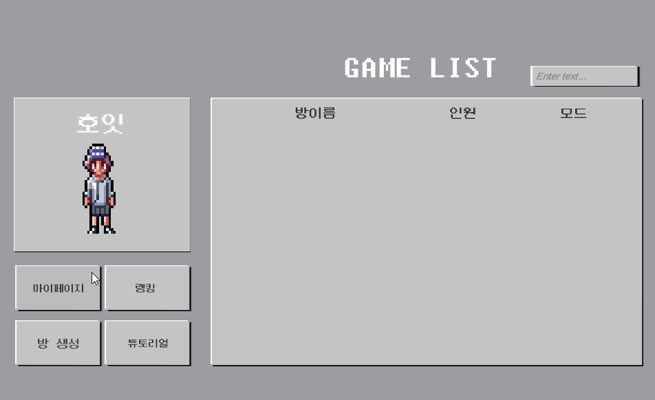

- **닉네임 및 비밀번호 변경**
  
  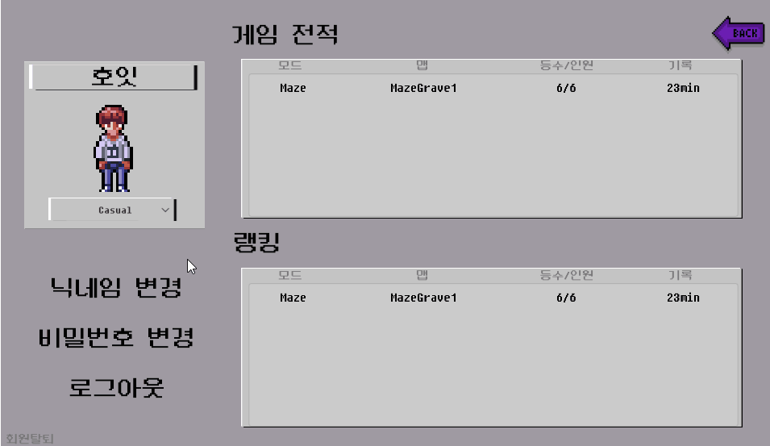

- **로그아웃**

- **회원탈퇴**
  
  
  
  
  
  ---

### 4. 대기실

- **게임 모드 선택 가능**

- **게임 캐릭터 선택 가능**

- **'레디' 클릭 시 게임 준비 완료 상태**
  
  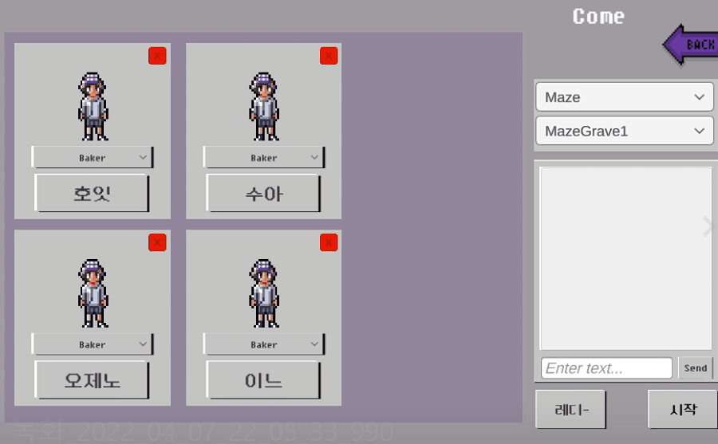
  
  
  
  ---

### 5. 미로찾기 게임

- **총 10가지의 맵 제공**
  
  - Maze Forest stage 1, 2, 3, 4
  
  - Maze Grave stage 1, 2, 3, 4, 5
  
  - Sullae Grave stage 1
  
  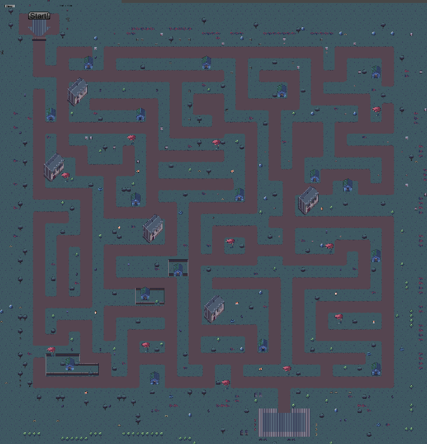
  
  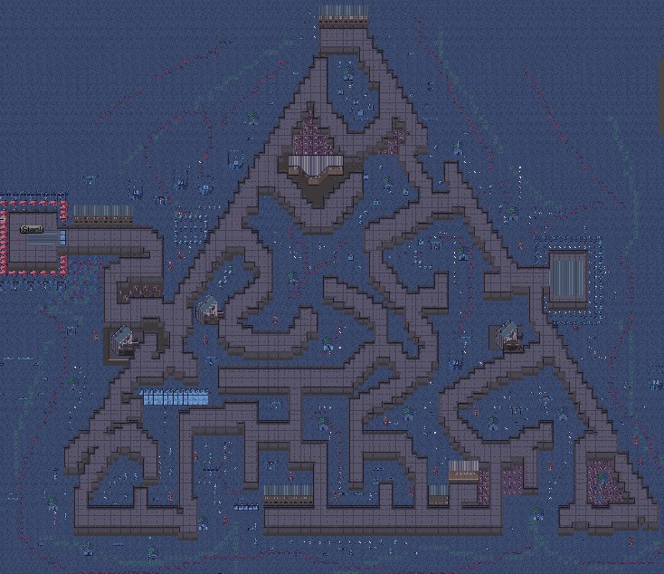
  
  

- **게임 시작 화면**: 5초 카운타다운 후 게임 시작 
  
  

- **게임 진행 화면**
  
  

- **게임 종료 화면**: 전원이 End Point에 들어오면 결과 확인 가능
  
  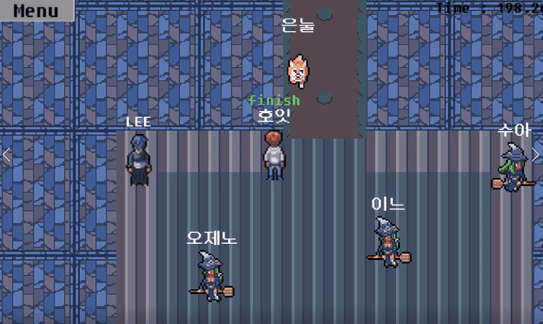
  
  

- **Menu 버튼 클릭 시**
  
  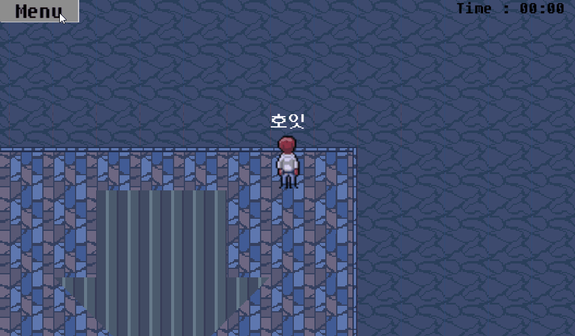
  
  
  
  ---

### 6. 랭킹

- **모드와 맵에 따른 게임 랭킹 확인 가능**
  
  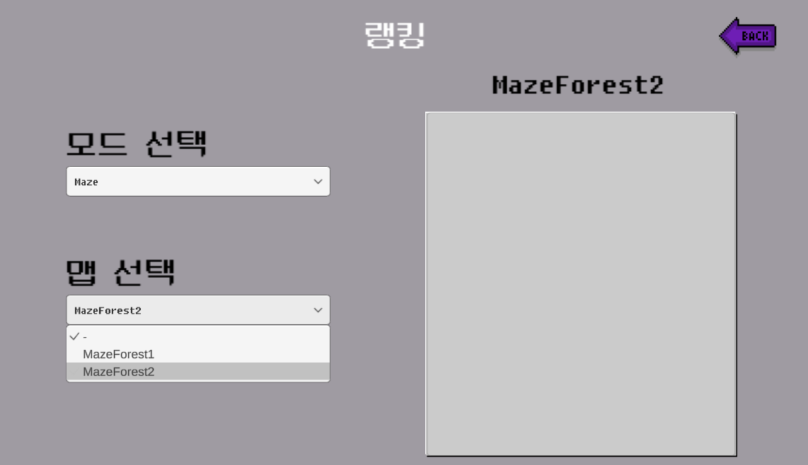

## :triangular_flag_on_post: 개발기록

### 3/7

1. 와이어프레임 상세

2. 유니티 기초 학습

### 3/8

1. ERD 초안 작성

2. 개발 계획 작성

3. [FE,BE] 유니티 학습

### 3/10

1. Unity Asset 선정
   
   1. Asset import 방법 학습

2. 컨설턴트님과의 미팅 

3. 전문가 미팅 준비

4. 팀명 회의 (하얀 천과 바람만 있다면 어디든 갈 수 있어)

### 3/11

1. 실습코치님과 미팅

2. 전문가님과의 미팅 

3. FrontEnd 맵 제작

4. BackEnd 영상인식 학습

### 3/14

1. 컨설턴트/코치님과 미팅 (전문가 미팅에 대한 리뷰)

2. 서버 정상 작동 확인 (pem 파일 지급 받음)

3. FrontEnd UI 만들기

4. BackEnd 영상인식 학습/ 유니티 웹 통신/ 멀티플레이 구현 (Webgl에서 막힘)

### 3/15

1. 유니티 학습

2. 파이어베이스 테스트

3. 장고 웹캠 테스트

4. 모의 SW 역량 테스트 A형

### 3/16

1. 프론트 - 로그인, 회원가입, 로비, 마이페이지, 방 (임시로 UI 구성)

2. 포톤을 활용한 멀티플레이 방 연구

3. 장고 웹소켓 테스트

4. 파이어베이스 로그인 구현

### 3/17

1. ppt 제작 및 발표회의

2. 프론트 - Scene 이동하기 완료

3. 프론트 스켈레톤 코드(파일 구조 정리) 수정 후 만든 Scene 재 설정

4. 백 - 로비페이지 서버 통신연구

5. 백 - 이메일 인증메일 보내기 및 프로필 사진 변경, 자동로그인

6. 백 - 파이썬 유니티 통신

### 3/18

1. ppt 수정, 발표 및 팀원 평가, 발표 감상

2. 프론트 - Ranking, 강퇴, 프로필 scene 제작

3. 프론트 - git 충돌 문제 해결

4. 백 - 로비페이지 서버 통신연구 

5. 백 - 구글 소셜 로그인 기능 구현 

### 3/21

1. 프론트 - 튜토리얼 scene 제작, 로비 scene 수정

2. 백 - 로비페이지 서버 통신완료 프론트 작업이랑 merge중 

3. 백 - 파이썬 유니티 통신 연구

4. 백 - 파이어베이스 프론트 UI 연결

5. 프론트 - WebGL 학습

### 3/22

1. 프론트 - 튜토리얼 scene 추가, Auth UI 수정, map 추가

2. 프론트 - 스테이지 제작 방법 연구

3. 백 - 장고 aws 배포 연구, 장고 유니티 통신 테스트 

4. 백 - Android -> WebGL 플랫폼 변경

5. 백 - 로비 스크립트, 수정사항 마무리

### 3/23

1. 백 - 장고 배포 연구

2. 프론트 - 인게임 화면 구현

3. 프론트 - 랭킹씬 수정

4. 프론트 - 맵 화면 구현

5. 프론트 - 로그인 UI 서버랑 연결, WebGL로 수정

### 3/24

1. 프론트 - 캠 안 켜지는 에러 해결 중

2. 프론트 - https 적용하기

3. 프론트 - 리액트 유니티 이벤트 적용

4. 프론트 - 룸에서 게임 선택 구현

5. 백 - WebGL 플랫폼에서 프로필 생성 구현

6. 백 - 포톤 rpc 연구

7. 백 - 장고 배포, 웹캠 오류 연구

### 3/25

1. 프론트 - 유니티 웹 통신 중

2. 프론트 - 유니티 모드 선택 가능

3. 프론트 - 멀티플레이 연구

4. 백 - 멀티플레이 연구

5. 백 - 웹캠 오류 연구

6. 백 - 로그아웃, 프로필 가져오기

### 3/28

1. 프론트 - 멀티플레이 구현

2. 백 - 웹캠 연결 연구 

3. 백 - 파이어베이스 db 세팅, CRUD 구현 

### 3/29

1. 프론트 - 닉네임 동기화 구현, 게임 종료화면 설정중

2. 백 - 게임종료 후 로비 이동, 게임 종료화면 설정중

3. 프론트 - 마이페이지 수정

4. 백 - 웹캠 연결 연구

5. 백 - 리액트 장고 통신 연구

6. 백 - 파이어베이스 DB, User 테이블 연결

### 3/30

1. 프론트 - 파이어베이스 / 게임 연결

2. 프론트 - 리액트/장고 연결 연구

3. 프론트 - 리액트 소켓 연결 연구

4. 백 - 파이어베이스 / 게임 연결

5. 백 - 파이어베이스 / 게임 연결

6. 백 - 리액트 https 배포 연구

### 3/31

1. 프론트 - 맵, 모드선택

2. 프론트 - 캐릭터 랜덤배정, 모든 맵에서 시작, 종료 구현

3. 프론트 - 리액트 웹캠 이미지캡쳐 사이즈 조절 연구

4. 프론트 - 장고 내부에서 소켓으로 텍스트 전송. 이제 웹캠 전송 가능한지 테스트 시도

5. 백 - 리액트에서 전송받은 이미지 영상인식 처리 연구

6. 백 - 게임 종료될때 기록 DB에 넣기, 랭킹페이지 연구

### 4/1

1. 프론트 - 소켓 연결 시도 -> 이미지 크기 변경

2. 프론트 - 리액트 장고 웹소켓 연결 연구

3. 프론트 - 게임 에러 수정 및 메뉴, 캐릭터 선택

4. 백 - 게임 에러 수정 및 메뉴, 캐릭터 선택

5. 백 - 리액트에서 유니티로 함수 호출

6. 백 - 랭킹페이지 데이터 연결 연구

### 4/4

1. 프론트 - 리액트 유니티 연결 연구

2. 백 - 리액트-장고 연결 최적화, 장고 유니티 연결, 유니티에서 리액트 함수 호출, 게임 시작시 웹캠 띄우기, 게임 종료시 웹캠 없애기

3. 백 - 리액트 소켓 연결

4. 프론트 - 배포 테스트 완료

### 4/5

1. 프론트 - 리액트 유니티 연결 연구

2. 프론트 - 캐릭터 연결 완료

3. 프론트 - 리액트 유니티 소켓 연결 연구

4. 프론트 - 리액트 UI 제작 

5. 백 - 파이어베이스 리액트 유니티 WebGL 병합 연구

### 4/6

1. 프론트, 백 - 파이어베이스 리액트 유니티 WebGL 병합 연구 및 구현

2. 프론트 - 리액트 페이지 디자인, Readme 작성

3. 프론트 - 유니티 사운드 추가, 술래잡기 연구

4. 프론트 - 사운드 조사, PPT, UCC 제작 진행중

5. 백 - 소셜 로그인 및 회원가입

### 4/7

1. 프론트 - 튜토리얼 완료

2. 프론트 - 리액트 컴포넌트 추가 및 툴팁 추가

3. 프론트 - 리액트 컴포넌트 , ready 기능 연구

4. 백 - 발표 준비, 영상인식 머리 컨트롤

5. 백 - 랭킹 완료, 캐릭터 설정

6. 백 - 술래잡기 구현, 배경음 추가
